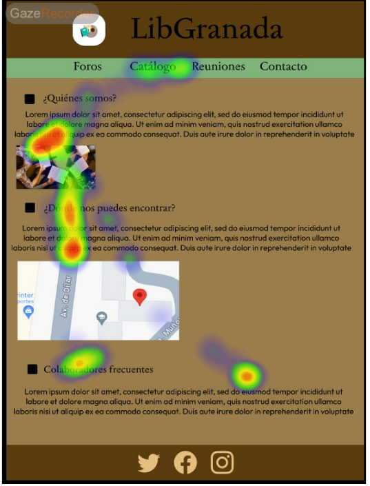
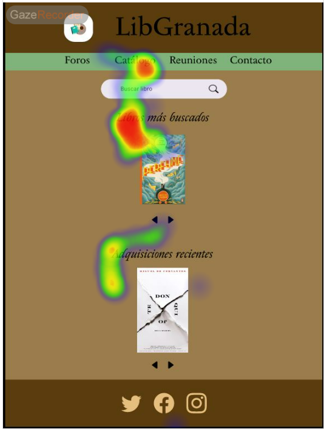

# DIU - Practica 4, entregables

Revisar [Asignacion_ABtesting](https://github.com/mgea/DIU/blob/master/P4/Asignacion_ABtesting.pdf)
Lista de grupos 

* [A/B Testing](Cuestionario%20SUS%20DIU.xlsx). 

* Tareas realizadas
  
Tarea 1 ; Observar la pagina principal

|  |  |
|:--------------------------------------------------:|:--------------------------------------------------:|

Tarea 2 ; Para la nuestra navegar hasta el buscador de la pagina para la de los compañeros hasta el contacto

|  |  |
|:--------------------------------------------------:|:--------------------------------------------------:|

Tarea 3 ; Para la nuestra navegar hasta los eventos de la pagina para la de los compañeros hasta el catalogo

|  |  |
|:--------------------------------------------------:|:--------------------------------------------------:|

* Resultados (izquierda experto ; derecha usuario )

Tarea 1 ; Observar la pagina principal

|  |  |
|:--------------------------------------------------:|:--------------------------------------------------:|
| |  |
|:--------------------------------------------------:|:--------------------------------------------------:|

Tarea 2 ; Para la nuestra navegar hasta el buscador de la pagina para la de los compañeros hasta el contacto

|  |  |
|:--------------------------------------------------:|:--------------------------------------------------:|
|  |  |
|:--------------------------------------------------:|:--------------------------------------------------:|

Tarea 3 ; Para la nuestra navegar hasta los eventos de la pagina para la de los compañeros hasta el catalogo

|  |  |
|:--------------------------------------------------:|:--------------------------------------------------:|
| |  |
|:--------------------------------------------------:|:--------------------------------------------------:|

* SUS Cuestionary

  
  
* Usability Report de Caso B
# Usability Report

El Usablity report se puede encontrar en el sigueinte [enlace](P4_UsabReport_LibGranada_doneby_DIU1_Stages.pdf)

