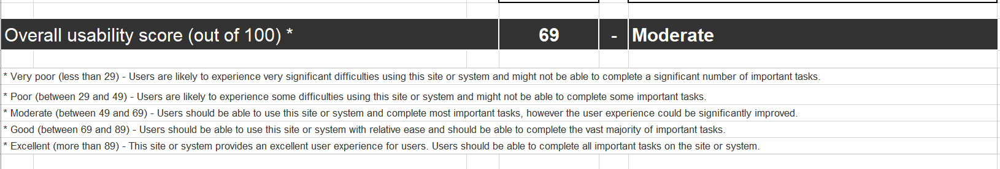
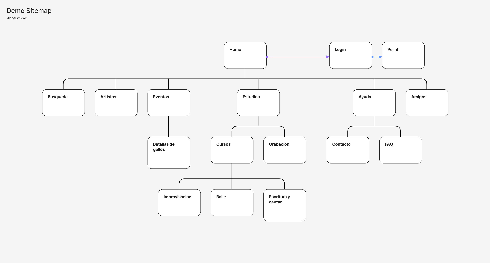

# DIU24
Prácticas Diseño Interfaces de Usuario 2023-24 (Tema: .... ) 

Grupo: DIU1.ChanguitosSaltarines  Curso: 2023/24 
Updated: 12/02/2024
[Enlace](https://github.com/DIU1/DIU1.ChanguitosSaltarines/tree/master)

Proyecto: 
>>> Decida el nombre corto de su propuesta en la práctica 2 

Descripción: 

>>> Describa la idea de su producto en la práctica 2 

Logotipo: 
>>> Opcionalmente si diseña un logotipo para su producto en la práctica 3 pongalo aqui

Miembros
 * :bust_in_silhouette:   Victor Casalini González  🐵     
 * :bust_in_silhouette:  Joaquín Salas Castillo     🐵

-----

# Proceso de Diseño 

## Paso 1. UX User & Desk Research & Analisis 

 **1.a User Reseach Plan**
-----
Razones por las cuales los usuarios podrían interesarse por ir a una escuela de teatro podrían ser:
- Conocer gente nueva y trabajar en equipo
- Inquietud sobre las artes escenicas
- Salir de la rutina
- Quieren expresarse artisticamente
- Desarrollarse personalmente, perdiendo la timidez o adquiriendo habilidades nuevas
- Por diversion
- Para dedicarse profesionalmente
[Pulsa aqui para verlo](https://github.com/DIU1/DIU1.ChanguitosSaltarines/blob/master/P1/User%20Research.pdf)

 1.b Competitive Analysis
-----
Hemos decidido hacer el analisis competitivo escogiendo la web base del guion https://escueladeteatroengranada.es/ y como competidores hemos elegido uno mas directo que es https://www.escuelapetite.com/ situado aquí mismo en granada y otro a nivel nacional https://estudiocorazza.com/.

[Pulsa aqui para verlo](https://github.com/DIU1/DIU1.ChanguitosSaltarines/blob/master/P1/Desk%20Research.pdf)

 1.c Persona
-----
En primer lugar hemos creado a [Alana del Rey](https://github.com/DIU1/DIU1.ChanguitosSaltarines/blob/master/P1/Persona1.png), Una persona que no estaba contenta con su situacion y sus estudios y decide dejar todo atras y mudarse a Granada para perseguir su sueño y tomar clases de teatro.

Luego hemos creado a [Juan Oeste](https://github.com/DIU1/DIU1.ChanguitosSaltarines/blob/master/P1/Persona2.png), era un apasionado de los deportes y esta en ultimo año de la carrera de ciencias del deporte y la actividad fisica pero debido a una lesion va tener que dejar de hacer deporte por un largo tiempo por lo que decide buscar otra actividad como es el doblaje.

 1.d User Journey Map
----
Hemos escogido estos casos porque tienen una gran capacidad de autodescubrimiento para nuestras personas y como se adaptan cada uno a experiencias a las que no estan aconstumbrados.

- [Alana del Rey](https://github.com/DIU1/DIU1.ChanguitosSaltarines/blob/master/P1/Journey%20map1.png)

- [Juan Oeste](https://github.com/DIU1/DIU1.ChanguitosSaltarines/blob/master/P1/Jorney%20map2.png)

 1.e Usability Review
----

Hemos realizamos un análisis más exhaustivo del teatro Remiendo mediante una revision de usabilidad que se puede encontrar [Usability review](P1/Usability-review.xlsx).

>>> Durante la evaluación, notamos que la prolongada carga de la página, junto con la aparición repetida del logo de la web con un símbolo de carga, puede resultar en una disminución significativa del interés del usuario, subrayando la urgencia de abordar estos problemas de rendimiento para mejorar la experiencia general del usuario.

## Paso 2. UX Design  

 2.a Reframing / IDEACION: Feedback Capture Grid / EMpathy map 
----
  
Entre las dos posibilidades nos hemos decidido por por hacer el empathy map para analizar el comportamiento de los usuarios que van a usar la aplicación.

Tambien puedes consultarlo [aqui](P2/Empathy%20Map.pdf)

 2.b ScopeCanvas
----
>>> Propuesta de valor
>>> [ScopeCanvas](P2/scope_canvas_resumen.pptx.pdf)

 2.b User Flow (task) analysis 
-----
En este apartado vamos a definir la secuencia de pasos que los usuarios tendrán que realizar para llevar a cabo las principales tareas que la aplicación permite.
>>> [Task analysis y userflow](P2/Task%20Analisys.pdf)

 2.c IA: Sitemap + Labelling 
----
Mapa del sitio que indica las distintas vistas que tendrá la aplicación y cómo se navega de unas a otras y labelling o etiquetadocde nuestro sitio web

Para una mayor comodidad se ha creado una jerarquía principal para tener una vista principal y luego poder analizar cada sector por separado.
[labelling](P2/Labelling.pdf)

 2.d Wireframes
-----
Inicialmente hemos realizado unos bocetos a mano y unos Wireframe centrandonos principalmente en como es van a distribuir los elementos en las distintas vistas.
A partir de lo anterior hemos realizado un grid layout con un diseño responsive utilizando el plugin breakpoint, en las siguinetes imagenes se puede ver el apartado
home y eventos con distintos tamaños.
>>> Home

>>> Eventos

## Paso 3. Mi UX-Case Study (diseño)

 3.a Moodboard
-----

>>> Este es nuestro moodboard para nuestra app
>>> 

  3.b Landing Page
----

>>> Esta va a ser nuestra pagina principal
>>> ----
>>> 

 3.c Guidelines
----

>>> Aqui se puede consultar informacion sobre nuestra [Guideline](P3/GUIDELINES.pdf)
>>> ----
>>> 

 4. Layout Hi-Fi
----

  3.d Mockup
----

>>> Layout: Mockup / prototipo HTML  (que permita simular tareas con estilo de IU seleccionado)

Los resultados de la P4 Y P5 se pueden ver en la carpeta [P4](P4)

